# TechFlow Tasks

## Sistema web de gerenciamento ágil de tarefas

**Empresa fictícia:** TechFlow Solutions  
**Contexto:** startup do setor de logística  
**Tecnologias:** Node.js, TypeScript, Express, SQLite, Vitest e GitHub Actions

O TechFlow Tasks foi desenvolvido para aplicar de forma prática conceitos de Engenharia de Software, modelagem UML, métodos ágeis, versionamento, testes automatizados, integração contínua e gestão de mudanças.

## 1. Descrição e escopo inicial

O projeto atende uma startup de logística que precisa visualizar o fluxo de atividades da equipe. O escopo inicial estabeleceu um CRUD de tarefas: cadastrar, listar, consultar, editar, movimentar entre estados e excluir. Cada tarefa continha título, descrição, status e datas de criação e atualização.

A solução usa uma API REST em TypeScript, persistência SQLite e uma interface web responsiva. O quadro possui as etapas **A Fazer**, **Em Progresso** e **Concluído**, permitindo que a equipe identifique rapidamente a situação do trabalho.

Não fazem parte do escopo acadêmico autenticação, múltiplas organizações, notificações externas ou sincronização em tempo real entre navegadores. Essa delimitação mantém o sistema pequeno, funcional e verificável.

## 2. Metodologia ágil

Foi adotado o **Kanban**, alinhado ao formato contínuo de uma operação logística. O método torna o trabalho visível, ajuda a identificar acúmulos e permite repriorização sem depender de ciclos fechados.

O GitHub Project representa o fluxo com `To Do`, `In Progress` e `Done`. Cada funcionalidade ou atividade de qualidade é registrada como card e movimentada conforme seu estado real. Os commits semânticos conectam o planejamento ao código produzido.

Como referência de mercado, o projeto se aproxima do uso de quadros visuais em soluções como **Trello**, que organiza trabalho por colunas e cartões movidos conforme o andamento. A escolha do Kanban neste contexto acadêmico segue a mesma lógica: tornar o fluxo operacional explícito, reduzir perda de contexto e facilitar priorização rápida.

O método é aplicado diretamente por meio de:

- visualização das tarefas e de seus estados;
- entrega incremental do CRUD;
- validação frequente por testes e integração contínua;
- mudança de escopo registrada em card e commit próprios;
- documentação das decisões e resultados.

## 3. Importância da modelagem

A modelagem reduz ambiguidades antes e durante a implementação. Ela comunica o comportamento esperado a pessoas técnicas e não técnicas, explicita responsabilidades e permite detectar lacunas com custo menor do que uma correção tardia no código.

O diagrama de casos de uso apresenta o sistema pela perspectiva dos usuários. O diagrama de classes descreve as estruturas e dependências internas. Juntos, eles conectam necessidade de negócio, comportamento e arquitetura.

### 3.1 Diagrama de casos de uso



O membro da equipe mantém e movimenta tarefas. O gestor também acompanha o fluxo e define prioridades para orientar decisões operacionais.

### 3.2 Diagrama de classes



`Task` representa a entidade central. `TaskRepository` concentra a persistência, enquanto as validações protegem a entrada da API. O Express coordena as requisições e o SQLite armazena os registros.

<div class="page-break"></div>

## 4. Beneficiários

Os membros da equipe operacional usam o quadro para consultar responsabilidades, atualizar atividades e informar conclusões. O gestor usa os estados e prioridades para identificar itens críticos, acompanhar o fluxo e decidir onde concentrar esforços. A organização é beneficiada pela rastreabilidade, comunicação centralizada e redução de tarefas esquecidas.

## 5. Falhas em projetos ágeis e mitigação

Entre as causas recorrentes de falha estão requisitos pouco claros, priorização inconsistente, comunicação fragmentada, ausência de responsabilidade, mudanças sem registro e falta de validação técnica. O rótulo “ágil” não elimina esses problemas; sem disciplina, ciclos curtos apenas produzem erros mais rapidamente.

O GitHub ajuda a mitigá-los ao centralizar cards, discussões, histórico de código, revisões e automações. O Project explicita prioridades e andamento. Commits preservam decisões técnicas. Pull requests permitem revisão. O Actions fornece retorno automático sobre qualidade. Essas ferramentas não substituem alinhamento humano, mas oferecem evidências e um processo compartilhado.

## 6. Testes automatizados e confiabilidade

A suíte utiliza Vitest e Supertest com um banco SQLite isolado em memória. Ela cobre criação válida, rejeição de título vazio, listagem, consulta por ID, atualização, estados inválidos, exclusão, recursos inexistentes, IDs inválidos e as regras de prioridade.

Os testes automatizados tornam as regras repetíveis e detectam regressões. No GitHub Actions, o mesmo conjunto é executado a cada push e pull request, junto ao ESLint e à compilação TypeScript. A combinação verifica comportamento, padronização e consistência de tipos antes da integração. Embora testes não provem ausência total de defeitos, reduzem significativamente o risco de entregar comportamentos já conhecidos como incorretos.

## 7. Gestão da mudança de escopo

Após o CRUD inicial, o cliente solicitou a identificação de tarefas críticas. A justificativa é operacional: atrasos com alto impacto precisam ser distinguidos de atividades rotineiras. Foi adicionado o campo de prioridade com os valores baixa, média e alta, além de destaque visual para a prioridade alta.

A alteração afetou entidade, esquema SQLite, repositório, validação, API, interface, documentação e testes. O banco aplica uma migração compatível, atribuindo prioridade média aos registros anteriores. Um card novo no Kanban e um commit `feat` específico preservam a rastreabilidade da solicitação.

Os principais desafios de mudanças ágeis são avaliar impacto, evitar regressões, manter dados anteriores e comunicar a nova regra. Neste projeto, eles foram tratados com análise de componentes afetados, valor padrão compatível, testes adicionais e atualização simultânea do README e do planejamento.

## 8. Arquitetura e execução

A interface consome uma API REST. A API valida entradas e delega persistência ao repositório SQLite. Essa separação mantém regras HTTP, domínio e armazenamento com responsabilidades claras.

Para executar:

```bash
npm install
npm run dev
```

Para verificar qualidade:

```bash
npm run lint
npm test
npm run build
```

## 9. Evidências do GitHub

As evidências finais apresentam o quadro Kanban com pelo menos dez cards, o histórico com commits semânticos e o workflow de integração contínua aprovado. Cada imagem deve ser acompanhada de comentário que explique o que ela comprova, conforme o roteiro em `docs/evidencias.md`.

### 9.1 Quadro Kanban


O quadro comprova a aplicação prática do Kanban no projeto, com fluxo visível entre `To Do`, `In Progress` e `Done`, além do registro das atividades técnicas e documentais exigidas pela disciplina.

### 9.2 Histórico de commits


O histórico comprova evolução incremental e rastreável, com mensagens semânticas que distinguem implementação, testes, integração contínua e documentação.

### 9.3 Integração contínua


O workflow aprovado comprova que o repositório executa validações automáticas de lint, testes e build antes da entrega final.

O repositório publicado está disponível em <https://github.com/gbprg/techflow>. O histórico de commits pode ser consultado em <https://github.com/gbprg/techflow/commits/main/> e a execução aprovada da integração contínua está registrada em <https://github.com/gbprg/techflow/actions/runs/28907372256>.

## 10. Conclusão

O TechFlow Tasks demonstra um ciclo de Engenharia de Software completo em escala acadêmica: escopo definido, modelagem, planejamento visual, implementação incremental, versionamento, testes, automação e gestão documentada de mudança. A solução atende o objetivo funcional e mantém evidências verificáveis de como foi construída.
